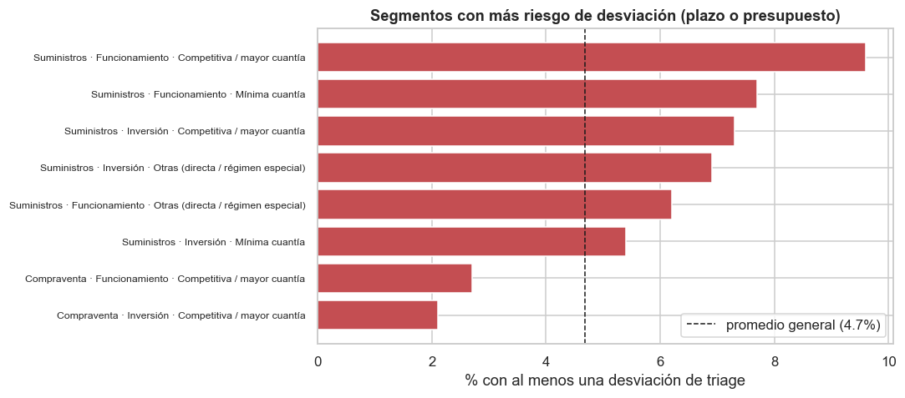
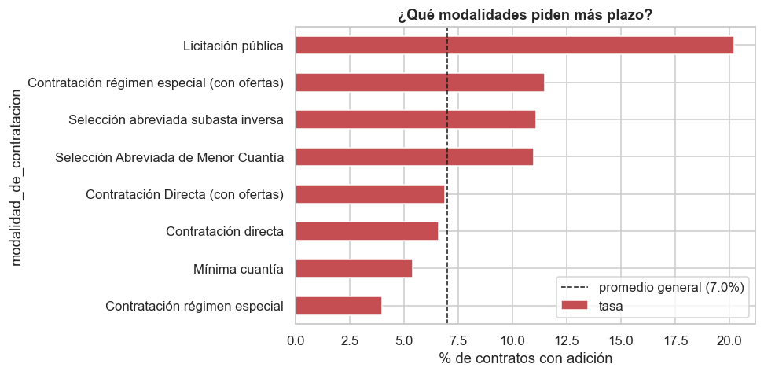
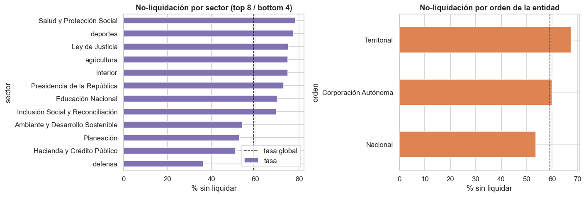

# Informe ejecutivo — ¿A qué contratos hacerles seguimiento?

**Taller 1 · MINE-4101 · Supervisión de contratación pública de bienes**
**Integrantes:** Daniel Triviño · Nicolás Bedoya

---

## En una frase

La oficina de control interno no puede vigilar de cerca los miles de contratos de bienes que se firman cada año,
así que este trabajo busca **decir, desde el momento de la firma, cuáles tienen más riesgo de desviarse** —para
concentrar ahí el seguimiento.

## Qué miramos

Analizamos ~196.000 contratos de bienes (compraventa y suministros) de SECOP II, firmados entre 2019 y 2025.
Nos concentramos en los firmados **hasta 2023** (los más recientes todavía están abiertos y no se puede saber si
terminaron bien). Definimos tres formas de "desviarse":

- **Pedir más plazo** (adiciones al contrato).
- **No ejecutar el presupuesto** que se había comprometido.
- **Cerrar sin liquidar** el contrato.

Y las cruzamos con las características que se conocen **al firmar**: valor, modalidad, tipo de contrato, sector,
orden de la entidad, destino del gasto y si el proveedor es PyME.

---

## Los hallazgos, en corto

1. **El valor del contrato avisa, pero hay que leerlo bien.** Los contratos **grandes** tienden a pedir más plazo
   y a no ejecutar el presupuesto; los **pequeños**, a cerrarse sin liquidar. No es que "más grande = más riesgo"
   siempre: depende de qué desviación preocupe.
2. **La modalidad predice las adiciones de plazo.** La **licitación pública** pide plazo extra en el ~20% de los
   casos, contra apenas ~5% en la **mínima cuantía**. Las modalidades competitivas y de mayor cuantía son las que
   más se alargan.
3. **El tipo de contrato marca la no-ejecución.** Los **suministros** dejan plata sin ejecutar mucho más (~13%)
   que las **compraventas** (~2%). Tiene lógica: el suministro se entrega por partes y es fácil que no se agote el
   monto reservado.
4. **La no-liquidación es un problema de proceso, no de contratos sueltos.** Le pasa a **~6 de cada 10** contratos
   cerrados, sobre todo en ciertos sectores (Salud ~78%) y en entidades **territoriales** (~67% vs ~54% en las
   nacionales). Como es tan común, no sirve para elegir a quién vigilar uno por uno; es una alerta para arreglar
   el proceso de cierre.
5. **El tamaño del proveedor (PyME) no ayuda.** No distingue a los contratos que se desvían. Es un dato útil justo
   porque evita gastar esfuerzo en un criterio que no discrimina.

---

## Criterios de focalización recomendados

La idea es sencilla: al firmar un contrato, sumar señales de riesgo. Entre más señales, más prioridad de
seguimiento. Ordenados de mayor a menor capacidad de discriminar:

### Prioridad ALTA — el perfil que más se desvía
Combinando las señales que sí sirven para elegir (pedir plazo **o** no ejecutar presupuesto), el grupo de mayor
riesgo es claro:

> **Suministros, de funcionamiento, contratados por modalidades competitivas o de mayor cuantía**
> (licitación pública, subasta inversa, selección abreviada).

Este perfil se desvía a una tasa de **casi el doble del promedio**. Es el primer candidato a seguimiento cercano
desde la firma.

### Señales individuales para sumar al triage
Aunque un contrato no caiga en el perfil de arriba, estas señales por sí solas ya elevan el riesgo:

| Señal (conocida al firmar) | Qué vigilar | Evidencia |
|---|---|---|
| **Modalidad** competitiva / de mayor cuantía (licitación, subasta, abreviada) | Riesgo de **adición de plazo** | Licitación ~20% vs mínima cuantía ~5% |
| **Tipo = Suministro** | Riesgo de **no ejecutar el presupuesto** | Suministros ~13% vs compraventa ~2% |
| **Destino = Funcionamiento** | Riesgo de **no ejecución** | Funcionamiento ~10% vs inversión ~5% |
| **Valor alto** (dentro de su sector) | Riesgo de **adición y no-ejecución** | Los desviados valen ~2–2,5× más (mediana) |

### Qué NO usar para focalizar
- **El tamaño del proveedor (PyME/no PyME).** No distingue a los que se desvían: priorizar por ahí sería gastar
  esfuerzo sin ganar precisión.

### Aparte del triage: una alerta de proceso
La **no-liquidación** (59% de los cerrados) no sirve para elegir contratos, pero sí marca **dónde** hay un
problema sistémico de cierre: **sector Salud** y **entidades territoriales**. Recomendación a nivel de gestión
(no de triage individual): revisar y reforzar el proceso de liquidación en esos frentes.

### Cómo se usaría en la práctica
Al firmar, marcar cuántas señales de riesgo cumple el contrato (modalidad competitiva, es suministro, es
funcionamiento, valor alto para su sector). Los que sumen varias —y sobre todo los del perfil de prioridad alta—
entran a la lista de seguimiento cercano. Es una regla simple, transparente y aplicable desde el día uno.

---

## Limitaciones (para leer los resultados con cuidado)

Somos honestos sobre hasta dónde llega este análisis:

- **Es descriptivo, no un modelo.** Miramos las señales de a una (o combinadas de forma simple en los segmentos),
  pero **no aislamos el efecto de cada variable controlando por las demás**. Por ejemplo, sector y orden están
  entrelazados; los separamos "a ojo" con un mapa de calor, no con un modelo. Un paso natural a futuro sería una
  regresión que dé el peso de cada factor ya ajustado.
- **La no-ejecución depende de un supuesto sobre datos faltantes.** El 44% de los contratos cerrados reporta
  ejecución en cero, que interpretamos como un vacío de captura y no como no-ejecución real. Si estuviéramos
  equivocados, la subejecución sería mucho mayor. La buena noticia: probamos el escenario extremo y **la
  conclusión práctica se mantiene** (los suministros siguen siendo los que más subejecutan).
- **Cuidado con la relación valor ↔ no-ejecución.** La forma en que medimos la no-ejecución usa el valor del
  contrato en el cálculo, así que parte de la relación "los grandes ejecutan menos" podría ser en parte un efecto
  de construcción, no solo del mundo real. Lo tomamos como señal de apoyo, no como prueba dura.
- **Con tantos datos, casi todo sale "significativo".** Por eso no nos guiamos por el p-valor sino por el tamaño
  del efecto; aun así, conviene no sobreinterpretar diferencias pequeñas.
- **Calidad de la fuente.** Son datos administrativos reales con vacíos e inconsistencias (fechas ilógicas,
  montos incompletos); los tratamos de forma documentada, pero cualquier conclusión hereda esas limitaciones.
- **Periodo.** El análisis de no-ejecución y no-liquidación se hizo sobre contratos firmados hasta 2023; los
  patrones podrían cambiar en años más recientes.

---

## Cierre

Con un equipo pequeño, la mejor apuesta es concentrar la supervisión en el **perfil de alto riesgo**
(suministros de funcionamiento en modalidades de mayor cuantía, y contratos de valor alto), usar las **señales
individuales** para afinar, y **no** gastar esfuerzo en criterios que no discriminan (como el tamaño del
proveedor). En paralelo, tratar la **no-liquidación** como lo que es: un problema de proceso a corregir en Salud
y en las entidades territoriales.

> El detalle metodológico, las pruebas estadísticas y las figuras están en los notebooks `01`, `02` y `03`.
